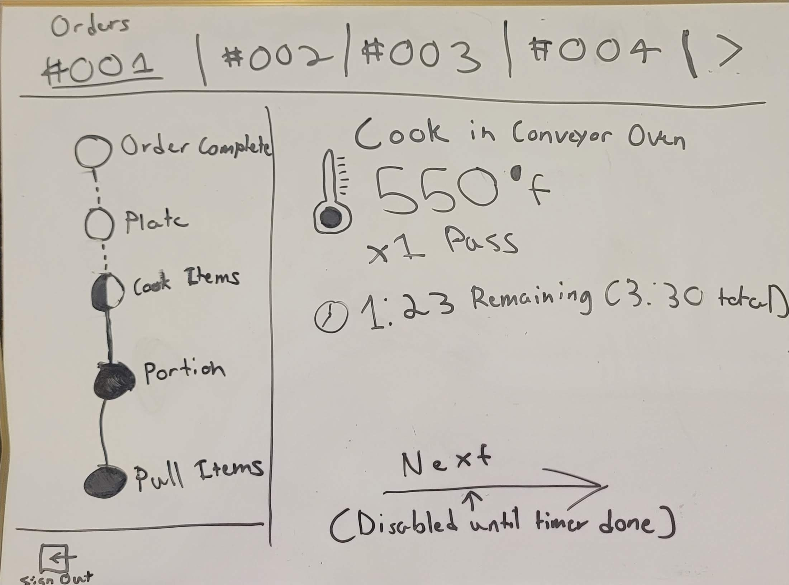

# Hot-Seats

## [View Deployed App](https://hot-seats.vercel.app)

## About

It's Friday night. Dinner rush is coming in. You just got a whole new team of chefs at your disposal and they have no idea what is on the menu. A waiter comes bursting in the kitchen. "Guys! There is a new popular app that just came out that can help us beat this dinner rush!" You look at the app "HotSeat". The waiter says "It will help you prep your meals faster while teaching the other chefs different prep times to get the orders out quickly and deliciously!" You clap your hands to get your teams attention. You yell out "TEAM IT IS TIME TO COOK!"

Hotseat is an app to enable restaurants to streamline the order preparation
process. It gives cooks the tools to coordinate their food prep to ensure
all food comes out synchronized and correctly cooked. It will feature a custom dashboard for
managing your menu and prep instructions. Additionally it will feature the prep stations that
receive orders in real time and guide the staff on how to prep and cook the meal.

## Technologies used

- Next.js (Full stack)
- Supabase (Realtime database built on PostgreSQL that has built in user authentication)
- TypeScript
- Vercel
- Git

## Wireframes

## MVP Goals
- [x] To allow users to log in and sign up via the login page and signup page
- [x] Allow users to pick what role they are filling in for the day
- [x] Allow users to create and tasks when they are in the manager role
- [x] Allow users to create orders and wipe them clean when not needed when they are in the point of sale role
- [x] Allow users to view orders and go through the steps when cooking the order when they are in the cook role

## Stretch Goals
- [] Sync timers for all food tasks
- [] Allow users to import their photos of food
- [] Allow combo customizations
- [] Allow item customization (example med rare steak/ soggy fries) 

## The Team
- Scrum Master : Will G.
- Peon : Brandon W.
